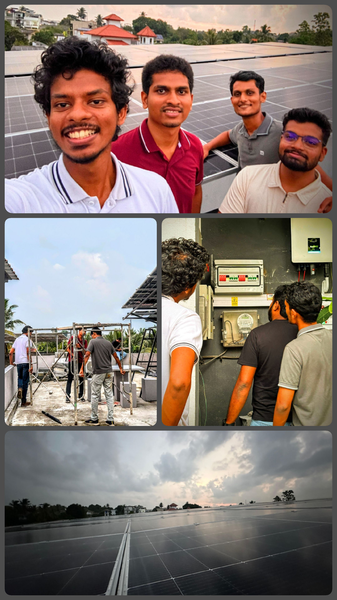

# 👋 Hi, I'm Ishan Udara Peiris  

🎓 **Undergraduate in Electronic and Telecommunication Engineering**  
🏛 **University of Moratuwa, Sri Lanka**  
💡 Passionate about **Embedded Systems** and **IoT**  

---

## 🛠 Technical Skills

- **Microcontrollers:** C/C++, Embedded C  
- **IoT Integration:** HTTP with Grafana & InfluxDB , MQTT with Node-RED   

---

## 🚀 Featured Project  

### 1️⃣ Smart Solar Inverter System  
🔋 A cutting-edge solution for efficient solar power generation with integrated IoT monitoring.  

**🛠 Technologies:**  
Embedded C, Grafana, InfluxDB, HTTP Protocol, Power Electronics  

**📈 Outcome:**  
Enhanced energy efficiency and anomaly detection  

  
   
  

  

**💡 What sets us apart?**  
- 🔹 Smart Control System for real-time optimization  
- 🔹 Synchronized energy sharing for maximum efficiency  
- 🔹 Ideal for off-grid locations and Kabana-type hotels needing reliable, synchronized solar power  
- 🔹 Focused on marketability and sustainable impact  

**🌱 Our Goal:**  
To enable maximum energy utilization, minimize losses, and deliver reliable, scalable solar energy for a greener future.  

🔗 **[SEIAN Inverter System](https://github.com/username/seian-inverter)** <!-- Replace with actual project link -->

---

## 📫 Connect With Me  
  
  

---
